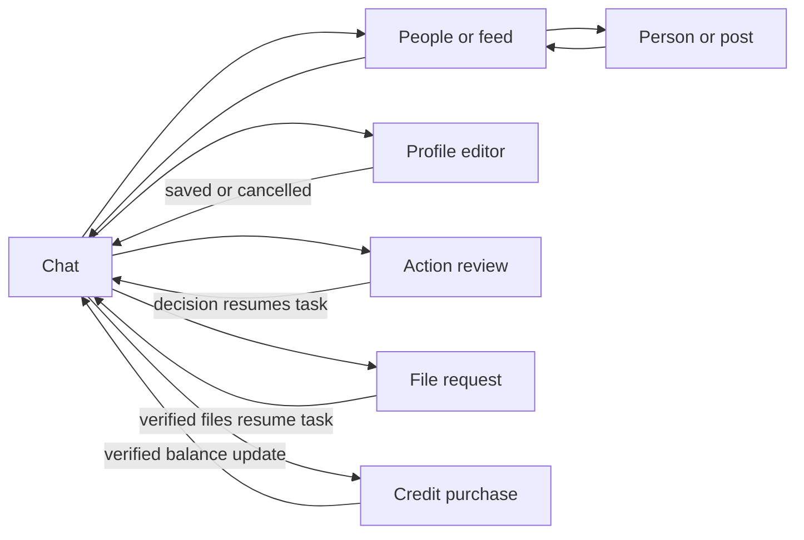
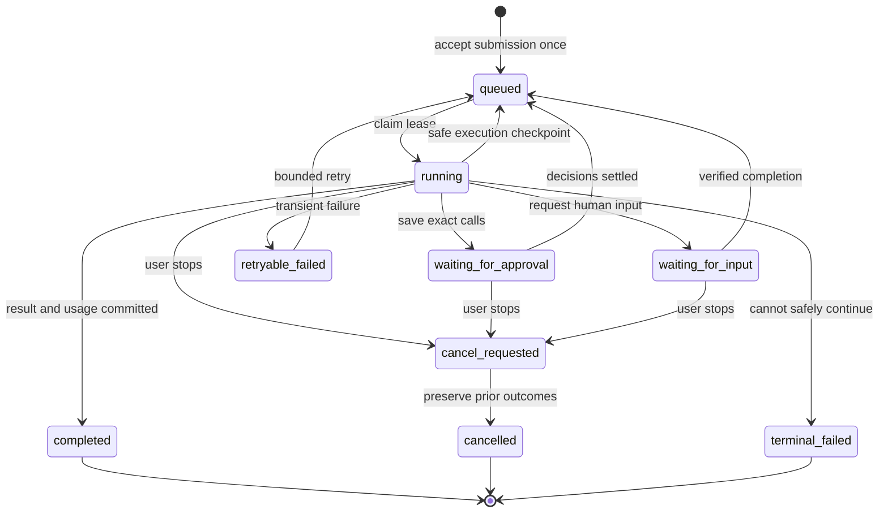

> Historical design study. The current implementation uses the hosted Agents API, not a local SDK runner. Current behavior and remaining gaps are recorded in [implementation status](implementation-status.md).

# New Drugs: product and implementation direction

Working design from the reference study begun 2026-09-25 00:47 UTC. This is an original design for New Drugs, informed by [Wayfinder](wayfinder-study/transfer.md) and [Pangaea](pangaea-study.md). No reference code or UI is to be directly ported.

## The product

New Drugs is a social app that a person can operate through an agent. Chat is the usual home. The person can also open the UI that fits the task: write their profile, browse people or posts, inspect a conversation, review a proposed action, upload a file, or add credit. Returning to chat preserves the context and work in progress.

The first screen remains the specified colorful gradient, draggable chat, input, and blue 3D microphone orb. The person writes their own profile text and chooses their own pictures. The agent operates the app's actual capabilities and coordinates work; it does not manufacture a social identity, invent people, or turn routine tasks into navigation instructions.

The shared operating layer is fundamental. A native button, the hosted agent, and an external CLI/MCP client must agree on identity, permissions, effects, and results. External agents can do their own reasoning and call the app directly without paying for a redundant hosted model.

## What each reference contributes

| Reference | Useful principles | Deliberate New Drugs differences |
| --- | --- | --- |
| Wayfinder | Complete operation contracts; a durable agent; exact confirmation; grouped review; verified results; upload continuation; real progress and usage accounting | Social records and personal privacy; no business/org product; zero markup; no direct code or UI port |
| Pangaea | Familiar social records and controls; scoped feeds; stable identities; temporary views that preserve a main view; human composition; readable typography and borders | Chat is the home; progressive task UIs; BFF-style human profiles; its county rules, ranking, permanent tabs, branding, and themes are not defaults here |

## A coherent surface model

The app should own a small surface stack. Each entry records its kind, exact resource/filter, originating conversation, and return target. View state belongs to the signed-in user and is cleared when identity changes.

The diagram describes responsibility, not mandatory full-screen pages. Some interactions belong inline with the conversation; others need a focused panel. A close/back action must have one predictable destination. Merely opening a surface never counts as completing its task.

A UI request carries a stable action ID and initiating client-session ID. An old request must not unexpectedly reopen a panel, run in another tab, or cross into another account. Completion is a verified application event, not a phrase the user has to type.

## Operations before adapters

Each capability has one current contract:

- Stable operation ID and version, intent description, strict input and projected output.
- Live authorization, ownership, applicable connection scopes, and human-authorship constraints.
- Effects and reversibility, with an explicit consequential-action confirmation policy.
- Full-input idempotency for writes; stable output identities and audit records.
- Declared result verification, including the distinction between accepted, complete, and unverified.
- Stable pagination and honest caps for reads.
- A native UI binding or typed human continuation where appropriate.

The browser, HTTP API, CLI, MCP, and hosted agent adapt this contract. They do not independently implement social rules. Capability discovery is generated from the active registry and current authority. Human-readable descriptions are maintained with the implementation, not inferred from endpoint names.

For the hosted agent, the model proposes an operation and its business input. Trusted host code supplies actor, run identity, idempotency, and any approved confirmation evidence. External hosts have a separate authenticated invocation contract. Neither path may bypass the domain's authorization or human-owned profile rule.

## Message acceptance and execution

Sending should clear the input and display the user message immediately. A short API request durably accepts the submission and returns its existing or new run identity. The provider runs independently. The UI observes ordered server state/events and reconnects to the same work.

The persistent conversation contains user turns, final assistant turns, status/action records, and a separate active draft/progress projection. Model session items preserve tool calls and results; a transcript of the last few visible bubbles is not the whole agent context.

This is a proposed New Drugs state model, not a copied enum. Every transition needs an implementation and a test. Model/tool execution uses the Agents SDK, but New Drugs owns its queue, leases, snapshots, session adapter, authority, and browser projection.

No worker may commit through an expired lease, stale state version, or cancelled run. A crash after a successful write must replay the same idempotent intent, not ask the model to invent a replacement. Changes that have already completed remain completed when a later step fails.

## Human decisions and native inputs

There are three different situations:

1. **Ordinary permitted action:** execute under host policy, record its result, and verify it. Do not add an unnecessary confirmation.
2. **Consequential action:** show exact targets and material effects, persist the decision against that payload, then resume the saved call. Group independent decisions when useful, while preserving individual outcomes.
3. **Human-authored or browser-owned step:** open the specific editor/upload/checkout interaction, keep the task's context, and continue from a real completion or cancellation event.

These should not all be implemented as generic modals or generic “confirm?” messages. In particular, the model cannot approve its own outgoing action, and closing a profile editor cannot be mistaken for saving it.

Profile creation immediately follows account creation. Profile text and photos remain human-owned. If a requested action truly depends on a profile field, its prerequisite must be part of the actual operation contract. Otherwise, the system must not introduce profile completion as an arbitrary gate. The prior Providence error is evidence that this boundary needs correction, not justification for inventing another onboarding loop.

## Progress and context

Visible thinking uses a short task-specific preamble plus actual runtime activity. Commentary stays separate from final text. A stopped or failed task explains confirmed outcomes and remaining uncertainty. Hidden reasoning is not displayed.

The model receives current, server-derived identity and an actual clock/timezone snapshot. Current records outrank old conversational facts. A native view can supply advisory page/resource context after server validation; viewing a record does not authorize a write.

Incoming social messages are data from another person. Receiving or displaying one does not authorize the recipient's agent to reply, accept an invitation, or agree to a plan. Wayfinder's passive Team Comms insertion is a useful reference for this boundary; New Drugs must define its own social lifecycle.

## Files and research

Files have an owner, purpose, immutable object identity, verified size/type/hash, readiness state, retention policy, and authorized delivery path. The model receives verified references/native file inputs, not arbitrary local paths or base64 in ordinary tool arguments. Upload submission resumes the right task automatically.

The hosted agent has real web search and retains actual citations. Search calls and file-related provider usage are metered. App facts come from app operations. An external agent can use its own reasoning and research without automatically invoking New Drugs' paid model.

## Infrastructure direction

Keep the familiar React/Vite, Express/Node, and MongoDB foundation unless implementation evidence exposes a material reason to change it. The reference architecture's guarantees do not require copying its cloud providers.

The missing infrastructure is deliberate durable execution: a worker queue, conditional leases, transactional state transitions, saved SDK context, ordered updates, and recovery. MongoDB runs as a replica set for transactions. A private blob-store abstraction handles files and encrypted run snapshots. The public HTTPS service exposes both the website and MCP.

Local ports remain 7330 for Vite, 7331 for the API, and 7332 for MongoDB. In production, HTTPS terminates at the host's web server; application/database ports remain private. Do not run a development Vite server as the public production service.

Deployment target supplied by the user: DigitalOcean droplet `24.144.121.19`, domain `druggie.org`. At 01:42 UTC, root SSH access was verified using the user's dedicated local deployment identity, and authoritative and recursive DNS both resolved to this IP. The host is fresh Ubuntu 24.04 with 1 GB RAM, 22 GB free disk, and no app/database/web services listening. Build locally, keep MongoDB's cache bounded, and run the API and database on private loopback ports.

Deployment must isolate New Drugs from other apps on the droplet, verify the existing runtime and occupied ports first, prepare a concrete build/configuration, and validate the site's HTTPS/API/MCP paths. Do not use Pangaea's deploy scripts against its app or restart it.

## Cost model

Record model usage, cached input, cache writes where charged, output, web-search calls, and transcription separately with a price snapshot. Meter each provider segment exactly once, including across pause/resume. A conservative pre-call spend check is not itself a charge.

Direct application operations do not implicitly launch a model. External CLI/MCP access remains free as specified. New Drugs adds no markup to hosted usage. Actual card processing costs must be explicit. Shared hosting/storage attribution remains a policy to state honestly; no invented surcharge or unsupported claim of complete cost recovery.

## Implementation order

1. Finish this reference study and reconcile the current prototype against it. Preserve the user's data and accepted visual changes.
2. Establish the original canonical operation registry and HTTP/CLI/MCP adapters, with authorization and projected-output tests in **New Drugs**.
3. Replace request-bound chat execution with a durable SDK-backed run/session/worker design. Prove duplicate submission, reconnect, cancellation, and crash recovery using a scripted model.
4. Implement exact consequential-write review, grouped decisions, immutable argument binding, and per-action outcomes. Test denial, expiry, drift, replay, and mixed success.
5. Implement typed native surfaces and human-input continuation, including sign-up to profile and profile save back into the task.
6. Implement verified uploads, native file reading, web search/citations, and complete cost checkpointing.
7. Build the requested social views on those same capabilities, using Pangaea's interaction lessons and New Drugs' own design.
8. Validate end-to-end behavior in New Drugs, then deploy the concrete tested build to the identified host once access and domain setup are ready.

Before each feature, read the relevant reference flow and tests as source, record the behavioral lesson, and implement it specifically for New Drugs. Do not copy reference code or run reference suites. Do not describe a dependency installation, partial endpoint, or written plan as a finished feature.
