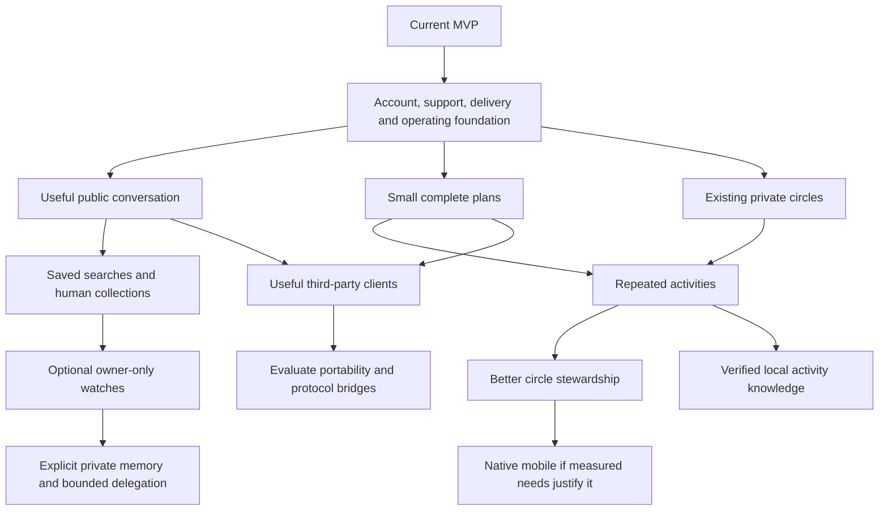

# Three practical roadmaps and a longer horizon

These are alternative sequences, not additive commitments. The timing below is a planning hypothesis for one focused builder with coding-agent help and a founder able to run a small pilot. It is not an estimate obtained by fully specifying every feature. Operator time, provider setup, real participant availability and review can extend it substantially.

A reasonable initial planning envelope is **six to twelve weeks for one useful next product loop**, followed by a decision. The shared foundation runs alongside that loop. We should not promise all eight directions from the opportunity map in that window.

## The common foundation

This is a small lane with explicit scope. It should protect an actual pilot rather than become an indefinite infrastructure project.

| Work | Why now | Minimum useful result | Expansion it enables |
| --- | --- | --- | --- |
| Account continuity | Social history and prepaid credit now matter | A supported recovery path, session/agent revocation, and a clear owner-help process | Any sustained usage |
| Leaving and data control | Trust becomes harder to retrofit | Account export/deletion design, live-data cleanup, disclosed necessary retention and a usable exit flow | More personal data, groups and memory |
| Report handling | Submission already exists | Owner case queue, actions, audit history and a truthful status for the reporter | Inviting more people the founder does not personally know |
| Starter-credit eligibility | Guest creation currently allocates a grant | Deliberate grant boundary, visible budget depletion, repeat-claim controls and separate stage accounting | A wider invitation wave |
| Payment proof | Live credentials and signatures are configured | Controlled sandbox purchase/refund tests, reconciliation and a support path for a missing credit | More paying hosted-agent users |
| Delivery and quiet controls | In-app notifications do not reach an absent person | One reliable opt-in channel for important events, per-context mute and a working return link | Plans, circles and reminders |
| Operating recovery | A healthy process is not a recovered service | Off-host data/required-file backup, a successful isolated restore and basic capacity alarms | Trusting the service with longer-lived relationships |
| Long-term conversation access | Current UI projects a recent window | Usable older-history paging and a clear private retention model | Regular hosted-agent use and later memory |

**Before a small known-person pilot:** know how to recover from failure, handle a report, explain the credit boundary and reach participants through a channel they agreed to use. Some support can be manual and explicitly described.

**Before wider public recruitment:** turn the repeatedly needed support paths into actual product/operator controls. Do not announce a report response promise that nobody can staff.

**Before background agents:** add inspectable authority, cost caps, quiet controls, stop/cancel behavior and evidence that revocation works. Background work is a later capability, not the default meaning of “agent.”

This is deliberately different from requiring an enterprise administration suite before anyone can post.

## Roadmap 1: local conversation into small plans

This is my recommended starting hypothesis.

### Phase 1. Observe the current social loop

Use the existing app with a small reachable cohort in one area. Let people browse and post normally. In parallel, support a few real activity proposals using current posts, invitations and DMs. Record where coordination actually stops.

Build only the foundation items needed to keep this cohort's experience safe and recoverable. Fix broken complete flows ahead of cosmetic additions. Include a person using only direct UI and a person using an external agent.

**Exit:** people can create an account, choose what to share, find a relevant person/post, understand the invitation, exchange a message, leave or block contact, and recover from an ordinary interruption. We have observed at least one actual coordination problem worth solving.

**Do not add yet:** a matching quiz, a new recommendation model, public group directories or a calendar integration.

### Phase 2. Complete one plan

Build a modest plan object and shared PlanCard/PlanPanel. Support a proposed activity, audience, a few time options or one chosen time, an optional deliberately shared meeting place, capacity, RSVP, cancellation and a discussion. Use the existing operation/receipt model.

The person can create, edit and manage it directly. The agent can create a private draft from an actual request, open it for human review, read current responses and prepare each invitation. Changing the time, audience or venue after people agree must be visible and may require renewed acceptance.

**Exit:** a plan can go from intention to invitation, acceptance, change, cancellation or completion without manual database work, invented confirmations or a person typing “done” to resume the agent.

**Do not add yet:** ticket sales, deposits, a complex waitlist, automatic calendar access or broad automatic outreach.

### Phase 3. Test repeat use

Run the plan flow for multiple real cycles. Observe what happened when someone could not attend, did not respond, changed their mind or received an update while the app was closed. Let participants create the next activity themselves.

Offer reuse of a past plan if people ask for it. Make a useful notification channel work before adding more event fields. Do not infer attendance from GPS, a calendar entry or an RSVP; a person can optionally say whether a plan happened and whether it was worthwhile.

**Exit:** at least some plans recur by participant choice with less founder coordination. Failure cases are understood, including whether low density, mismatched interest or the interface was responsible.

**Decision:** if repeat plans produce a stable little group, move toward circles. If people mostly enjoy conversation, take Roadmap 2. If the app only works while the founder arranges everything, narrow the use case before adding more software.

### Phase 4. Earn one proactive feature

Only after the basic loop is useful, try one owner-only watch: a saved public search, a reminder about an explicit plan, or a chosen weekly catch-up. Give it a visible off switch, expiry, notification policy and cost policy. Test whether people keep it enabled.

**Exit:** assistance saves a concrete step without surprising the person or generating unwanted contact. If it mainly creates noise, remove it and keep the manual product.

**Illustrative pacing:** one to two weeks observing/fixing the current loop, two to four weeks on the smallest complete plan flow, two or more calendar weeks of real use, then a focused next slice. These activities can overlap, but their evidence cannot be skipped.

## Roadmap 2: a good local internet first

Choose this if people want the community's conversation more than an event planner.

### Phase 1. Make the current feed worth reading

Keep the existing social controls and improve complete browsing: returning to the same place, clearer local/global scope, useful author/profile transitions, older content access and fewer dead ends. Add bookmarks and muting. These should be ordinary direct controls and shared operations.

Separate “posts tagged near this area” from any future “posts by discoverable people near me.” Do not use a person's private profile area to silently geotag their posts.

**Exit:** people can find, save and return to content they care about without relying on the agent to navigate for them.

### Phase 2. Add a following relationship only if needed

A directed follow can improve reading without granting DM access. Keep the current invitation relationship for contact. Explain the distinction through labels and behavior, not a lengthy onboarding lecture.

Build a small Following view, with chronological ordering and block/mute rules. Avoid public popularity machinery unless it serves a concrete user need.

**Exit:** people use follows to shape their reading and understand that it is not a mutual social commitment.

### Phase 3. Turn temporary curation into something reusable

Let a person save a search or name a collection. Distinguish a snapshot of selected IDs from a live search recipe. The former preserves chosen items; the latter can change as new posts arrive. Both recheck visibility when opened.

The agent can assemble a list, explain its sources and save it only when asked. A person can do the same through direct controls. Keep ordinary browsing available when semantic search is unavailable.

**Exit:** saved views get reopened because they are useful, not because a notification keeps promoting them.

### Phase 4. Find the natural bridge into action

Inspect the actual conversations. If people routinely suggest meeting, add a small plan handoff. If they ask for collaborators, start with project invitations. If they trade help, try offer/request status. Let behavior choose the next structured record.

**Illustrative pacing:** six to ten weeks for foundations, a small set of reading controls, a community pilot and one reusable discovery feature. A more ambitious feed engine is not part of this first sequence.

**Main failure signal:** the product needs constant founder-generated prompts or algorithmic novelty to appear alive. Change the community/use case before adding another feed mechanic.

## Roadmap 3: bring a small circle

Choose this if the founder can reach existing friend groups, clubs or recurring communities. It is the strongest way to make the app useful before broad local density exists, but it needs a new authorization model.

### Phase 1. Define the membership promise

Choose the initial circle type and a simple policy. For example: private by default, explicit invitations, owner/co-host roles, clear member list, a real leave action and explicit history visibility. Decide what a block means when both people belong to the same group.

Do not expose every possible visibility/posting/entry setting from Pangaea. Its separate controls are useful evidence that these are distinct decisions; they are not a mandate for five new dropdowns on the first screen.

**Exit:** we can answer who sees a group, who can join, what new members can read, who can invite, what leaving removes and how unwanted contact is stopped.

### Phase 2. Make one shared space work

Build member management and one useful group conversation or feed. Add a limited plan flow for the recurring activity. Carry the same audience checks through search, file access, notifications, exports and agent reads.

Do not widen the existing two-person DM by adding extra IDs to its members array. Several current paths assume a pair. Treat group authorization as a real domain change.

**Exit:** two real groups can use their shared space manually, with a working invitation, leave, block and moderator path. New members do not receive surprising access to old private context.

### Phase 3. Support a repeated rhythm

Add reusable or recurring plans, co-host continuity, a few pinned links and per-circle quiet controls. A group summary should link to actual messages and should be available only to an authorized member. An owner cannot grant their agent another member's private notes.

**Exit:** groups choose to return for their activity without the app requiring everyone to become an administrator.

### Phase 4. Open discovery carefully

A circle can choose a public invitation post or a discoverable description. Private membership and historical conversation do not automatically become public. New people request entry or receive an explicit invitation under the chosen policy.

**Illustrative pacing:** eight to twelve weeks for a bounded membership model, direct UI/operations, a delivery channel and multiple group cycles. A Discord-like permissions system, thousands of members and unlimited media are out of this first slice.

**Main failure signal:** hosts spend more effort managing the app than organizing the activity, or participants do not understand who can see what.

## A six-to-twelve-month option map

This is a set of conditional branches after a successful first loop, not a dated feature promise.

The CLI/MCP layer already exists under every branch. The last branch means a broader ecosystem or protocol commitment, not postponing parity.

At that horizon, plausible work includes richer remote activities, collaboration calls, local help exchanges, a maintained activity dataset, media improvements, optional private calendar coordination and a broader support/governance model. Each should have an observed demand signal and a funding/operating owner.

## Which combinations make sense

| Combination | Why it can work | Keep the boundary clear |
| --- | --- | --- |
| Local conversation + plans | Posts create context for an invitation; plans make follow-through easier | A post does not have to become a plan |
| Plans + circles | A good outing can become a repeated activity | RSVP does not automatically enroll a person forever |
| Circles + making things | A small shared purpose can sustain repeated contact | Avoid turning the circle into a project-management suite |
| Public discovery + local guide | Useful external options can help a thin network provide value | External facts need sources and freshness |
| Any useful loop + private reminders | Saves steps around something the person actually values | Reminder consent does not authorize outreach |
| Any useful loop + external clients | Different agents and UIs can serve different people | The canonical authority and cost rules stay the same |

## Combinations I would avoid early

Building circles, a full events directory, personal memory and federation at once creates four independent permission systems before any one has earned its place. Likewise, a powerful automatic agent over an empty network has little useful social work to perform.

The practical rule is one new primary social record at a time. A plan is one record family. A circle is another. Make its manual and agent lifecycle complete, then decide whether it deserves the next layer.

## The decision after the first pilot

Ask these in order:

1. What did people actually come back for: conversation, a particular group, practical planning, useful help, or the agent itself?
2. Which step repeatedly prevented the intended outcome?
3. Did a feature reduce effort for participants, or move that effort to an unpaid host/operator?
4. What happened without the founder, without hosted AI and without a large local user pool?
5. What evidence would make us stop or change the direction?

The answer should choose the next roadmap. The existence of a flexible agent should not choose it for us.
